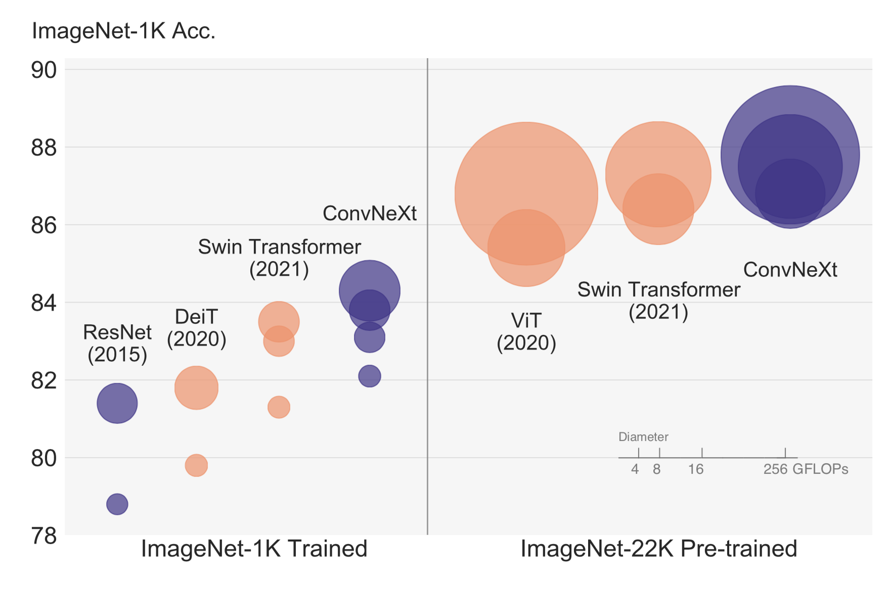
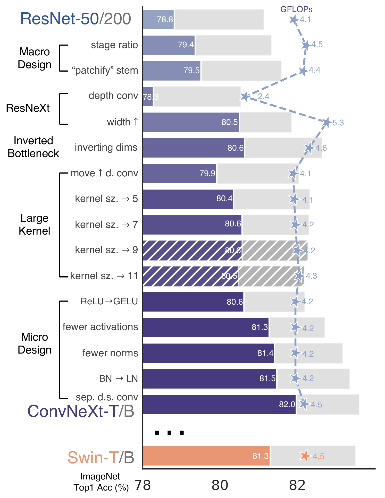

# Implementing ConvNext in PyTorch

Hello There!! Today we are going to implement the famous ConvNext in PyTorch proposed in [A ConvNet for the 2020s
](https://arxiv.org/abs/2201.03545).

Code is here, an interactive version of this article can be downloaded from here.

Let's get started!

The paper proposes a new convolution-based architecture that not only surpasses Transformer-based model (such as Swin) but also scales with the amount of data! The following pictures show ConvNext accuracy against the different datasets/models sizes.


</img>


So the authors started by taking the well know ResNet architecture and iteratively improving it following new best practices and discoveries made in the last decade. The authors focused on Swin-Transformer and follows closely its design choices.  The paper is top-notch, I highly recommend read it :) 

The following image shows all the various improvements and the respective performance after each one of them. 

</img>

They divided their roadmap into two parts: macro design and micro design. Macro design is all the changes we do from a high-level perspective, e.g. the number of stages, while micro design is more about smaller things, e.g. which activation to use.

We will now start with a classic BottleNeck block and apply each change one after the one.

### Starting point: ResNet

As you know (if you don't I have an [article about implementing ResNet in PyTorch](https://medium.com/p/a7da63c7b278)) ResNet uses a residual BottleNeck block, this will be our starting point.


```python
from torch import nn
from torch import Tensor
from typing import List

class ConvNormAct(nn.Sequential):
    """
    A little util layer composed by (conv) -> (norm) -> (act) layers.
    """
    def __init__(
        self,
        in_features: int,
        out_features: int,
        kernel_size: int,
        norm = nn.BatchNorm2d,
        act = nn.ReLU,
        **kwargs
    ):
        super().__init__(
            nn.Conv2d(
                in_features,
                out_features,
                kernel_size=kernel_size,
                padding=kernel_size // 2,
                **kwargs
            ),
            norm(out_features),
            act(),
        )

class BottleNeckBlock(nn.Module):
    def __init__(
        self,
        in_features: int,
        out_features: int,
        reduction: int = 4,
        stride: int = 1,
    ):
        super().__init__()
        reduced_features = out_features // reduction
        self.block = nn.Sequential(
            # wide -> narrow
            ConvNormAct(
                in_features, reduced_features, kernel_size=1, stride=stride, bias=False
            ),
            # narrow -> narrow
            ConvNormAct(reduced_features, reduced_features, kernel_size=3, bias=False),
            # narrow -> wide
            ConvNormAct(reduced_features, out_features, kernel_size=1, bias=False, act=nn.Identity),
        )
        self.shortcut = (
            nn.Sequential(
                ConvNormAct(
                    in_features, out_features, kernel_size=1, stride=stride, bias=False
                )
            )
            if in_features != out_features
            else nn.Identity()
        )

        self.act = nn.ReLU()

    def forward(self, x: Tensor) -> Tensor:
        res = x
        x = self.block(x)
        res = self.shortcut(res)
        x += res
        x = self.act(x)
        return x
```

Let's check if it works


```python
import torch
x = torch.rand(1, 32, 7, 7)
block = BottleNeckBlock(32, 64)
block(x).shape
```


    torch.Size([1, 64, 7, 7])


Let's also define a `Stage`, a collection of `blocks`. Each stage usually downsamples the input by a factor of `2`, this is done in the first block.


```python
class ConvNexStage(nn.Sequential):
    def __init__(
        self, in_features: int, out_features: int, depth: int, stride: int = 2, **kwargs
    ):
        super().__init__(
            # downsample is done here
            BottleNeckBlock(in_features, out_features, stride=stride, **kwargs),
            *[
                BottleNeckBlock(out_features, out_features, **kwargs)
                for _ in range(depth - 1)
            ],
        )
```


```python
stage = ConvNexStage(32, 64, depth=2)
stage(x).shape
```


    torch.Size([1, 64, 4, 4])


Cool, notice how the input was reduced from `7x7` to `4x4`.

ResNet also has what is called `stem`, the first layer in the model that does the heavy downsampling of the input image. 


```python
class ConvNextStem(nn.Sequential):
    def __init__(self, in_features: int, out_features: int):
        super().__init__(
            ConvNormAct(
                in_features, out_features, kernel_size=7, stride=2
            ),
            nn.MaxPool2d(kernel_size=3, stride=2, padding=1),
        )
```

Cool, now we can define `ConvNextEncoder` that holds a list of stages and takes an image as input producing the final embeddings.


```python
class ConvNextEncoder(nn.Module):
    def __init__(
        self,
        in_channels: int,
        stem_features: int,
        depths: List[int],
        widths: List[int],
    ):
        super().__init__()
        self.stem = ConvNextStem(in_channels, stem_features)

        in_out_widths = list(zip(widths, widths[1:]))

        self.stages = nn.ModuleList(
            [
                ConvNexStage(stem_features, widths[0], depths[0], stride=1),
                *[
                    ConvNexStage(in_features, out_features, depth)
                    for (in_features, out_features), depth in zip(
                        in_out_widths, depths[1:]
                    )
                ],
            ]
        )

    def forward(self, x):
        x = self.stem(x)
        for stage in self.stages:
            x = stage(x)
        return x
```


```python
image = torch.rand(1, 3, 224, 224)
encoder = ConvNextEncoder(in_channels=3, stem_features=64, depths=[3,4,6,4], widths=[256, 512, 1024, 2048])
encoder(image).shape
```


    torch.Size([1, 2048, 7, 7])


This is your normal `resnet50` encoder, if you attach a classification head you get back the good old resnet50 ready to be train on image classification tasks.

## Macro Design

### Changing stage compute ratio

In ResNet we have 4 stages, Swin Transformer uses a ratio of `1:1:3:1` (so one block in the first stage, one in the second, third in the third one ...). Adjusting ResNet50 to this ratio (`(3, 4, 6, 3)` -> `(3, 3, 9, 3)`) results in a performance increase from `78.8%` to `79.4%`.


```python
encoder = ConvNextEncoder(in_channels=3, stem_features=64, depths=[3,3,9,3], widths=[256, 512, 1024, 2048])
```

### Changing stem to “Patchify”

ResNet stem uses a very aggressive 7x7 conv and a maxpool to heavily downsample the input images. However, Transformers uses a "patchify" stem, meaning they embed the input images in patches. Vision Transfomers uses very aggressive patching (16x16), the authors use 4x4 patch implemented with conv layer. The accuracy changes from `79.4%` to `79.5%` suggesting patching works.


```python
class ConvNextStem(nn.Sequential):
    def __init__(self, in_features: int, out_features: int):
        super().__init__(
            nn.Conv2d(in_features, out_features, kernel_size=4, stride=4),
            nn.BatchNorm2d(out_features)
        )
```

### ResNeXt-ify

[ResNetXt](https://arxiv.org/abs/1512.03385) employs grouped convolution for the 3x3 conv layer in the BottleNeck to reduce FLOPS. In ConvNext, they use depth-wise convolution (like in MobileNet and later in EfficientNet). Depth-wise convs are grouped convolutions where the number of groups is equal to the number of input channels. 

The authors notice that is very similar to the weighted sum operation in self-attention, which mixes information only in the spatial dimension. Using depth-wise convs reduce the accuracy (since we are not increasing the widths like in ResNetXt), this is expected. 

So we change our 3x3 conv inside `BottleNeck` block to 

```
ConvNormAct(reduced_features, reduced_features, kernel_size=3, bias=False, groups=reduced_features)
```

### Inverted Bottleneck

Our BottleNeck first reduces the features via a 1x1 conv, then it applies the heavy 3x3 conv and finally expands the features to the original size. An inverted bottleneck block, does the opposite. I have a [whole article](https://medium.com/p/89d7b7e7c6bc) with nice visualization about them.

So we go from `wide -> narrow -> wide` to `narrow -> wide -> narrow`. 

This is similar to Transformers, since the MLP layer follows the `narrow -> wide -> narrow` design, the second dense layer in the MLP expands the input's feature by a factor of four.


```python
class BottleNeckBlock(nn.Module):
    def __init__(
        self,
        in_features: int,
        out_features: int,
        expansion: int = 4,
        stride: int = 1,
    ):
        super().__init__()
        expanded_features = out_features * expansion
        self.block = nn.Sequential(
            # narrow -> wide
            ConvNormAct(
                in_features, expanded_features, kernel_size=1, stride=stride, bias=False
            ),
            # wide -> wide (with depth-wise)
            ConvNormAct(expanded_features, expanded_features, kernel_size=3, bias=False, groups=in_features),
            # wide -> narrow
            ConvNormAct(expanded_features, out_features, kernel_size=1, bias=False, act=nn.Identity),
        )
        self.shortcut = (
            nn.Sequential(
                ConvNormAct(
                    in_features, out_features, kernel_size=1, stride=stride, bias=False
                )
            )
            if in_features != out_features
            else nn.Identity()
        )

        self.act = nn.ReLU()

    def forward(self, x: Tensor) -> Tensor:
        res = x
        x = self.block(x)
        res = self.shortcut(res)
        x += res
        x = self.act(x)
        return x
```

### Large Kernel Sizes

Modern Vision Transfomer, like Swin, uses a bigger kernel size (7x7). Increasing the kernel size will make the computation more expensive, so we move up the big depth-wise conv, by doing so we will have fewer channels. The authors note this is similar to Transformers model where the Multihead Self Attention (MSA) is done before the MLP layers.


```python
class BottleNeckBlock(nn.Module):
    def __init__(
        self,
        in_features: int,
        out_features: int,
        expansion: int = 4,
        stride: int = 1,
    ):
        super().__init__()
        expanded_features = out_features * expansion
        self.block = nn.Sequential(
            # narrow -> wide (with depth-wise and bigger kernel)
            ConvNormAct(
                in_features, in_features, kernel_size=7, stride=stride, bias=False, groups=in_features
            ),
            # wide -> wide 
            ConvNormAct(in_features, expanded_features, kernel_size=1),
            # wide -> narrow
            ConvNormAct(expanded_features, out_features, kernel_size=1, bias=False, act=nn.Identity),
        )
        self.shortcut = (
            nn.Sequential(
                ConvNormAct(
                    in_features, out_features, kernel_size=1, stride=stride, bias=False
                )
            )
            if in_features != out_features
            else nn.Identity()
        )

        self.act = nn.ReLU()

    def forward(self, x: Tensor) -> Tensor:
        res = x
        x = self.block(x)
        res = self.shortcut(res)
        x += res
        x = self.act(x)
        return x
```

This increases accuracy from `79.9%` to `80.6%`

## Micro Design
### Replacing ReLU with GELU

Since GELU is used by the most advanced transformers, why not use it in our model? The authors report the accuracy stays unchanged. In PyTorch GELU in `nn.GELU`.

### Fewer activation functions

Our block has three activation functions. While, in Transformer block, there is only one activation function, the one inside the MLP block. The authors removed all the activations except for the one after the middle conv layer. This improves accuracy to `81.3%` matching Swin-T!


### Fewer normalization layers

Similar to activations, Transformers blocks have fewer normalization layers. The authors decide the remove all the BatchNorm and kept only the one before the middle conv.

### Substituting BN with LN

Well, they substitute the BatchNorm layers with LinearyNorm. They note that doing so in the original ResNet hurts performance, but after all our changes, the performance increases to `81.5%`

So, let's apply them


```python
class BottleNeckBlock(nn.Module):
    def __init__(
        self,
        in_features: int,
        out_features: int,
        expansion: int = 4,
        stride: int = 1,
    ):
        super().__init__()
        expanded_features = out_features * expansion
        self.block = nn.Sequential(
            # narrow -> wide (with depth-wise and bigger kernel)
            nn.Conv2d(
                in_features, in_features, kernel_size=7, stride=stride, bias=False, groups=in_features
            ),
            # GroupNorm with num_groups=1 is the same as LayerNorm but works for 2D data
            nn.GroupNorm(num_groups=1, num_channels=in_features),
            # wide -> wide 
            nn.Conv2d(in_features, expanded_features, kernel_size=1),
            nn.GELU(),
            # wide -> narrow
            nn.Conv2d(expanded_features, out_features, kernel_size=1),
        )
        self.shortcut = (
            nn.Sequential(
                ConvNormAct(
                    in_features, out_features, kernel_size=1, stride=stride, bias=False
                )
            )
            if in_features != out_features
            else nn.Identity()
        )


    def forward(self, x: Tensor) -> Tensor:
        res = x
        x = self.block(x)
        res = self.shortcut(res)
        x += res
        return x
```

### Separate downsampling layers.

In ResNet the downsampling is done by the `stride=2` conv. Transformers (and other conv nets too) have a separate downsampling block. The authors removed the `stride=2` and add a downsampling block before the three convs using a `2x2` `stride=2` conv. Normalization is needed before the downsampling operation to maintain stability during training. We can add this module to our `ConvNexStage`. Finally, we reach `82.0%` surpassing Swin!


```python
class ConvNexStage(nn.Sequential):
    def __init__(
        self, in_features: int, out_features: int, depth: int, **kwargs
    ):
        super().__init__(
            # add the downsampler
            nn.Sequential(
                nn.GroupNorm(num_groups=1, num_channels=in_features),
                nn.Conv2d(in_features, out_features, kernel_size=2, stride=2)
            ),
            *[
                BottleNeckBlock(out_features, out_features, **kwargs)
                for _ in range(depth)
            ],
        )
```

Now we can clean our `BottleNeckBlock`


```python
class BottleNeckBlock(nn.Module):
    def __init__(
        self,
        in_features: int,
        out_features: int,
        expansion: int = 4,
    ):
        super().__init__()
        expanded_features = out_features * expansion
        self.block = nn.Sequential(
            # narrow -> wide (with depth-wise and bigger kernel)
            nn.Conv2d(
                in_features, in_features, kernel_size=7, padding=3, bias=False, groups=in_features
            ),
            # GroupNorm with num_groups=1 is the same as LayerNorm but works for 2D data
            nn.GroupNorm(num_groups=1, num_channels=in_features),
            # wide -> wide 
            nn.Conv2d(in_features, expanded_features, kernel_size=1),
            nn.GELU(),
            # wide -> narrow
            nn.Conv2d(expanded_features, out_features, kernel_size=1),
        )

    def forward(self, x: Tensor) -> Tensor:
        res = x
        x = self.block(x)
        x += res
        return x
```

We finally arrive to our final block! Let's test it


```python
stage = ConvNexStage(32, 62, depth=1)
stage(torch.randn(1, 32, 14, 14)).shape
```


    torch.Size([1, 62, 7, 7])


## Final touches

They also added Stochastic Depth, also known as Drop Path, (I have an [article](https://towardsdatascience.com/implementing-stochastic-depth-drop-path-in-pytorch-291498c4a974) about it) and Layer Scale.


```python
from torchvision.ops import StochasticDepth

class LayerScaler(nn.Module):
    def __init__(self, init_value: float, dimensions: int):
        super().__init__()
        self.gamma = nn.Parameter(init_value * torch.ones((dimensions)), 
                                    requires_grad=True)
        
    def forward(self, x):
        return self.gamma[None,...,None,None] * x

class BottleNeckBlock(nn.Module):
    def __init__(
        self,
        in_features: int,
        out_features: int,
        expansion: int = 4,
        drop_p: float = .0,
        layer_scaler_init_value: float = 1e-6,
    ):
        super().__init__()
        expanded_features = out_features * expansion
        self.block = nn.Sequential(
            # narrow -> wide (with depth-wise and bigger kernel)
            nn.Conv2d(
                in_features, in_features, kernel_size=7, padding=3, bias=False, groups=in_features
            ),
            # GroupNorm with num_groups=1 is the same as LayerNorm but works for 2D data
            nn.GroupNorm(num_groups=1, num_channels=in_features),
            # wide -> wide 
            nn.Conv2d(in_features, expanded_features, kernel_size=1),
            nn.GELU(),
            # wide -> narrow
            nn.Conv2d(expanded_features, out_features, kernel_size=1),
        )
        self.layer_scaler = LayerScaler(layer_scaler_init_value, out_features)
        self.drop_path = StochasticDepth(drop_p, mode="batch")

        
    def forward(self, x: Tensor) -> Tensor:
        res = x
        x = self.block(x)
        x = self.layer_scaler(x)
        x = self.drop_path(x)
        x += res
        return x
```

et voilà 🎉 We have arrived to the final ConvNext Block! Let's see if it works!


```python
stage = ConvNexStage(32, 62, depth=1)
stage(torch.randn(1, 32, 14, 14)).shape
```


    torch.Size([1, 62, 7, 7])


Super! We need to create the drop paths probabilities in the encoder


```python
class ConvNextEncoder(nn.Module):
    def __init__(
        self,
        in_channels: int,
        stem_features: int,
        depths: List[int],
        widths: List[int],
        drop_p: float = .0,
    ):
        super().__init__()
        self.stem = ConvNextStem(in_channels, stem_features)

        in_out_widths = list(zip(widths, widths[1:]))
        # create drop paths probabilities (one for each stage)
        drop_probs = [x.item() for x in torch.linspace(0, drop_p, sum(depths))] 
        
        self.stages = nn.ModuleList(
            [
                ConvNexStage(stem_features, widths[0], depths[0], drop_p=drop_probs[0]),
                *[
                    ConvNexStage(in_features, out_features, depth, drop_p=drop_p)
                    for (in_features, out_features), depth, drop_p in zip(
                        in_out_widths, depths[1:], drop_probs[1:]
                    )
                ],
            ]
        )
        

    def forward(self, x):
        x = self.stem(x)
        for stage in self.stages:
            x = stage(x)
        return x
```


```python
image = torch.rand(1, 3, 224, 224)
encoder = ConvNextEncoder(in_channels=3, stem_features=64, depths=[3,4,6,4], widths=[256, 512, 1024, 2048])
encoder(image).shape
```


    torch.Size([1, 2048, 3, 3])


To get the final ConvNext used for Image classification we need to apply a classification head on top of the encoder. We also add a `LayerNorm` before the last linear layer. 


```python
class ClassificationHead(nn.Sequential):
    def __init__(self, num_channels: int, num_classes: int = 1000):
        super().__init__(
            nn.AdaptiveAvgPool2d((1, 1)),
            nn.Flatten(1),
            nn.LayerNorm(num_channels),
            nn.Linear(num_channels, num_classes)
        )
    
    
class ConvNextForImageClassification(nn.Sequential):
    def __init__(self,  
                 in_channels: int,
                 stem_features: int,
                 depths: List[int],
                 widths: List[int],
                 drop_p: float = .0,
                 num_classes: int = 1000):
        super().__init__()
        self.encoder = ConvNextEncoder(in_channels, stem_features, depths, widths, drop_p)
        self.head = ClassificationHead(widths[-1], num_classes)
```


```python
image = torch.rand(1, 3, 224, 224)
classifier = ConvNextForImageClassification(in_channels=3, stem_features=64, depths=[3,4,6,4], widths=[256, 512, 1024, 2048])
classifier(image).shape
```


    torch.Size([1, 1000])


And here you have it!

## Conclusions

In this article we have seen, step by step, all the changes the Authors did to create ConvNext from ResNet. I hope this was useful :)

Thank you for reading it!

Francesco
